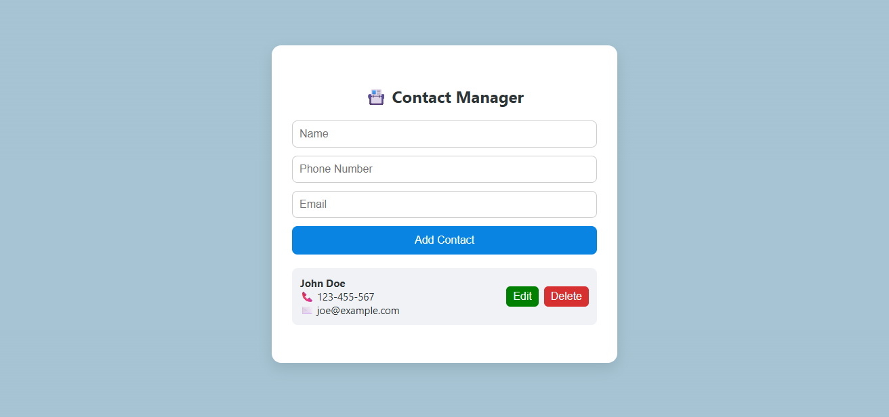

# 📇 Contact Manager 

> 🔧 A lightweight, browser-based contact manager using HTML, CSS, and JavaScript.

---

## 🎯 Project Goal

This project was built to:

- Practice using **JavaScript objects** in a real-world scenario.
- Dynamically update the **DOM using JavaScript**.
- Learn how to **persist user data using `localStorage`**.
 

---

## 🧠 What You’ll Learn

- How to structure and handle **objects** in JavaScript.
- Use of **event listeners** for interactivity.
- Use of `localStorage` for browser-side data storage.
- DOM manipulation using `createElement`, `appendChild`, and `.value`.
- Updating the UI with a `renderContacts()` function.
- Using `Array.prototype.filter()` to remove data.

---

## 🚀 Features

- ✅ Add new contacts with name, phone, and email
- ✏️ Edit contact details
- 🗑️ Delete individual contacts
- 🔁 Data persists after reload using `localStorage`
 
---

## 🖼️ Preview

> _(Add your screenshot here once you have it)_

---

 

